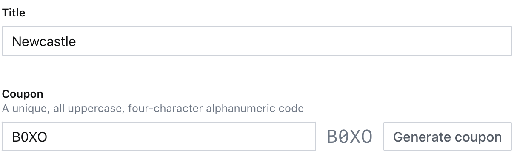
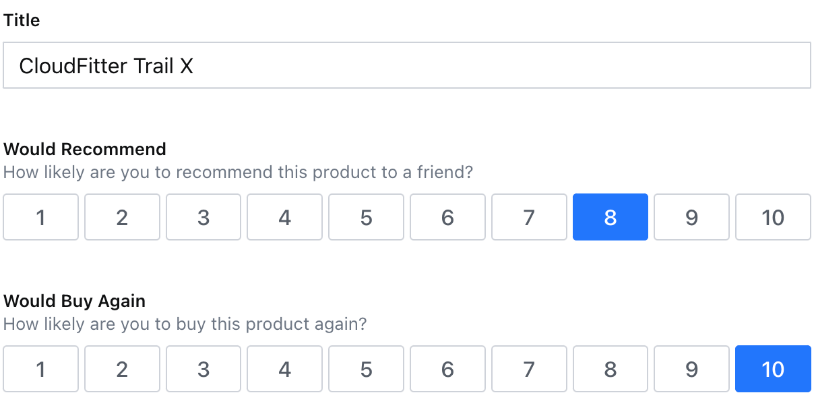
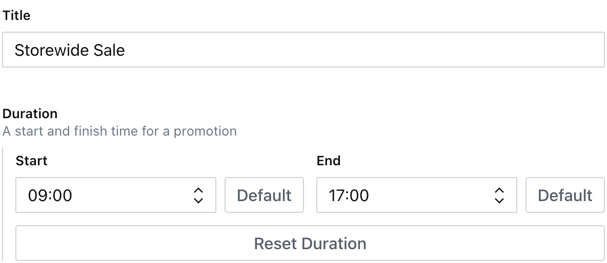
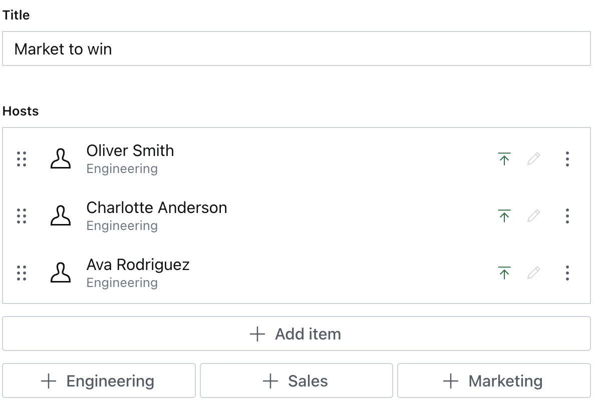

# Sanity Studio v3: Typed Code Examples

I'd like to turn these into guides. If I haven't done this already, bug me on [Slack](https://slack.sanity.io/).

## Custom Inputs

See the [Form Components docs on sanity.io](https://www.sanity.io/docs/form-components-reference) for more details.

- [Sanity Studio v3: Typed Code Examples](#sanity-studio-v3-typed-code-examples)
  - [Custom Inputs](#custom-inputs)
    - [String input](#string-input)
    - [Number input](#number-input)
    - [Object input](#object-input)
    - [Decorated array input](#decorated-array-input)
    - [Object: All component levels](#object-all-component-levels)
    - [Arrays of Objects](#arrays-of-objects)
  - [Tools](#tools)

### String input

The `store` document type contains an example `CouponGenerator` custom input. Click the "Generate Coupon" button to create a random string and populate the field.



---

### Number input

The `survey` document type contains an example `RatingSelector` custom input. Click buttons 1-10 to set a number on the field.



---

### Object input

The `promotion` document type contains an example `DurationInput` custom input. This demonstrates how to make fine-grained and whole-field changes to a field.



---

### Decorated array input

The `seminar` document type contains an example `HostsSelector` custom input. This demonstrates how to add extra buttons below an array field to quickly add items to the array.



### Object: All component levels

Custom components for schema items can be loaded at four different points, and they display a little differently.

```ts
components: {
  field: MyCustomField,
  input: MyCustomInput,
  item: MyCustomItem,
  preview: MyCustomPreview,
}
```

Getting the Types to play nicely can be complicated, so in this repo are code examples on how to load custom components for objects and satisfy TypeScript.

See `./components/` for examples.

### Arrays of Objects

The `report` document type features a `table` schema which demonstrates a _very_ complex custom input component.

It is setup like:

- a `table` is an `object` with an `array` of `rows`
- each `row` is an `object` with an `array` of `cells`
- each `cell` is an `object` with whatever fields you like

The custom input controls all of this from the root level and allows editing without clicking into modals. With the option to open the modal for more details about the field.

The `table` schema also has `options: { compact: false }` which sets the fields to either only show the input or the entire field with title, description, validation, presence, etc.

It is not a battle-tested component but may contain clues for the sort of array editing experience you're considering.

## Tools

Tools are a way to use a custom component with full-screen real estate. For a different modality for working with Sanity content or doing completely different operations entirely.

In `sanity.config.ts` there is a custom tool loaded as a plugin. Using a plugin helps isolate away specific functionality and makes re-use between projects easier.

A Tool can take a key-value pair of `options` which are passed into the `component` as props.
